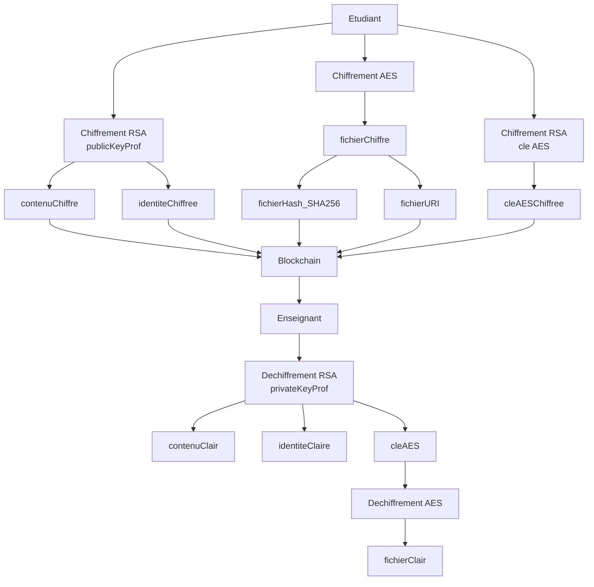
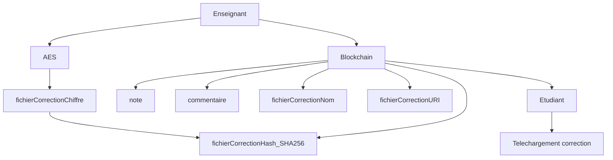

# 📚 Système de Gestion des Contrôles - Blockchain (ENSA Tétouan)

> Projet Final - Module Fondamentaux de la Blockchain (M356)  
> ENSA Tétouan - Département IA & Digitalisation


## 🎯 À Propos

Plateforme décentralisée de gestion des contrôles/devoirs basée sur **Ethereum**, avec :
- gestion des **rôles** (Admin / Enseignant / Étudiant),
- gestion des **modules & coefficients**,
- **soumissions chiffrées** (RSA pour texte + AES pour fichiers),
- **upload off-chain** des fichiers (serveur Express + multer),
- **anti-plagiat simple** côté enseignant (comparaison de similarité).

L’objectif est de garantir **traçabilité**, **intégrité**, **équité** et **confidentialité** des soumissions.

---

## ✨ Fonctionnalités clés

### ✅ Gestion académique
- **Admin** : inscrit enseignants/étudiants + affecte les étudiants aux modules
- **Enseignant** : crée des devoirs dans ses modules + corrige ses soumissions
- **Étudiant** : voit uniquement les devoirs de ses modules + soumet avant la date limite

### 🔐 Chiffrement & Fichiers
- **Texte (réponse + identité)** : chiffré en **RSA (RSA-OAEP 2048)** avec la clé publique du prof
- **Fichier (optionnel)** : chiffré en **AES**, puis uploadé sur serveur off-chain
- La **clé AES** est ensuite chiffrée en RSA avec la clé publique du prof
- Le prof **déchiffre** avec sa **clé privée locale** (jamais stockée on-chain)

### 🧾 Correction
- Correction liée à une **soumission précise** (donc automatiquement liée à l’étudiant qui a soumis)
- Possibilité d’ajouter un **fichier de correction** (upload)

---

## 🏗️ Architecture

```
┌─────────────────────────────────────────────────────┐
│                   FRONTEND (React)                   │
│  ┌──────────────┐  ┌──────────────┐  ┌───────────┐ │
│  │ Enseignants  │  │  Étudiants   │  │   Admin   │ │
│  └──────────────┘  └──────────────┘  └───────────┘ │
└───────────────────────┬─────────────────────────────┘
                        │ Ethers.js
                        ▼
┌─────────────────────────────────────────────────────┐
│              SMART CONTRACT (Solidity)               │
│  ┌─────────────────────────────────────────────┐   │
│  │   SystemeGestionControles.sol               │   │
│  │   • Gestion des devoirs                     │   │
│  │   • Soumissions chiffrées                   │   │
│  │   • Corrections                              │   │
│  │   • Annonces                                 │   │
│  └─────────────────────────────────────────────┘   │
└───────────────────────┬─────────────────────────────┘
                        │
                        ▼
┌─────────────────────────────────────────────────────┐
│              BLOCKCHAIN ETHEREUM                     │
│         (Immuable, Décentralisée, Sécurisée)        │
└─────────────────────────────────────────────────────┘
```

## 🚀 Installation Rapide

### Prérequis

- Node.js v16+
- NPM ou Yarn
- MetaMask
- Git

### Étape 1 : Cloner le projet

```bash
git clone <url-du-repo>
cd systeme-gestion-controles-blockchain
```

### Étape 2 : Installer les dépendances

```bash
# Backend
npm install

# Frontend
cd frontend
npm install
cd ..
```

### Étape 3 : Upload server
```bash
cd upload-server
npm init -y
npm i express cors multer
cd ..
```
### Étape 4 : Compiler le contrat

```bash
npx hardhat compile
```

### Étape 5 : Démarrer le réseau local

```bash
# Terminal 1
npx hardhat node
```

### Étape 6 : Déployer le contrat

```bash
# Terminal 2
npx hardhat run scripts/deploy.js --network localhost
```
Le script écrit l’adresse dans contract-address.json.
Ensuite, mets à jour l’adresse dans frontend/src/App.jsx :
```bash
const CONTRACT_ADDRESS = "ADRESSE_DEPLOYEE";
```
### Étape 8 : Lancer backend
```bash
cd upload-server
npm init -y
npm i express cors multer
node server.js
```
Serveur : http://localhost:5001

Upload : POST http://localhost:5001/upload

Download : http://localhost:5001/files/<filename>
### Étape 8 : Lancer l'interface

```bash
cd frontend
npm run dev
```

Accéder à `http://localhost:3000` 

## 📖 Guide d'Utilisation

### Pour l'Administrateur (deployeur)

1. Se connecter avec le wallet déployeur (admin)
2. Inscrire enseignants + étudiants
3. Affecter les étudiants aux modules (un étudiant peut être inscrit dans plusieurs modules)
**Important : l’étudiant ne peut soumettre que s’il est inscrit au module du devoir.**
```bash
# Utiliser le script interactif
npx hardhat run scripts/manage-users.js --network localhost
```

### Pour les Enseignants

1. Se connecter avec MetaMask
2. Aller dans Profil → Générer & enregistrer :
   -clé publique enregistrée on-chain
   -clé privée stockée localement (navigateur)
3. Créer un devoir (uniquement dans ses modules)
4. Corriger :
   -charger ses soumissions
   -coller / charger sa clé privée
   -déchiffrer + noter

Chaque soumission est liée à l’étudiant via msg.sender dans le smart contract.

### Pour les Étudiants
1. Se connecter avec MetaMask
2. Voir uniquement les devoirs des modules où il est inscrit
3. Soumettre :
   -texte chiffré RSA
   -fichier optionnel chiffré AES + upload

4. Consulter ses notes & télécharger la correction si disponible

## 🔒 Sécurité

### RSA (texte)

-L’enseignant publie sa clé publique (profil) sur la blockchain.
-Lors de la création du devoir, le devoir stocke la clé publique de chiffrement.
-L’étudiant chiffre identité + réponse avec la clé publique du devoir.

### AES (fichier)

-L’étudiant génère une clé AES aléatoire
-chiffre le fichier avec AES
-upload le contenu chiffré au serveur
-chiffre la clé AES avec la clé publique RSA du prof
-stocke (hash/nom/type/uri/cleAESChiffree) dans la blockchain

**La clé privée n’est jamais stockée on-chain.**
## Sécurité et chiffrement (RSA + AES) : details

Ce projet utilise un **chiffrement hybride** combinant **RSA** et **AES**, comme dans les systèmes réels (HTTPS, PGP, etc.).

**Objectif :**
- Garantir que **seul l’enseignant** peut lire les soumissions
- Chiffrer efficacement les **textes** et les **fichiers**
- Éviter toute gestion de clés côté étudiant

---

## 1. Algorithmes utilisés

### 🔑 RSA (asymétrique)
- Paire de clés : **clé publique / clé privée**
- Utilisé pour :
  - Chiffrer le texte (`contenuChiffre`, `identiteChiffree`)
  - Chiffrer la **clé AES** (`cleAESChiffree`)
- Clé publique : stockée **on-chain** dans le devoir
- Clé privée : stockée **localement chez l’enseignant**

Dans le code :
- `rsaEncrypt(message, publicKey)`
- `rsaDecrypt(ciphertext, privateKey)`
- RSA-OAEP 2048 + SHA-256 (WebCrypto)

---

### 🗝️ AES (symétrique)
- Une **seule clé secrète**
- Utilisé pour :
  - Chiffrer les **fichiers volumineux** (PDF, DOC, ZIP…)
- Rapide et efficace pour les gros fichiers

Dans le code :
- `generateAESKey()`
- `encryptFileContentToString(file, aesKey)`
- `decryptAesStringToBytes(encrypted, aesKey)`

---

### 🔍 SHA-256 (hash)
- **Ne chiffre pas**
- Sert à vérifier l’intégrité du contenu
- Si le fichier change → le hash change

📌 Utilisé pour :
- `fichierHash`
- Vérification d’intégrité des fichiers uploadés

---

## 2. Principe du chiffrement hybride (simple)

- RSA seul → trop lent pour les fichiers
- AES seul → problème pour transmettre la clé
- **RSA + AES** → solution optimale

**Idée clé :**
> Le fichier est chiffré avec AES,  
> et la clé AES est chiffrée avec RSA.

---

## 3. Flux : Étudiant → Blockchain → Enseignant

```text
[ ÉTUDIANT ]
    |
    |-- RSA(publicKeyProf)
    |      ├─ contenuChiffre        (réponse texte)
    |      ├─ identiteChiffree      (nom / identité)
    |
    |-- AES
    |      ├─ fichier chiffré
    |      ├─ fichierHash (SHA-256)
    |
    |-- RSA(publicKeyProf)
    |      └─ cleAESChiffree
    |
    v
[ BLOCKCHAIN ]
    ├─ contenuChiffre
    ├─ identiteChiffree
    ├─ fichierHash
    ├─ fichierNom
    ├─ fichierType
    ├─ fichierURI          (serveur d’upload)
    ├─ cleAESChiffree
    └─ etudiant = msg.sender (adresse Ethereum)
    |
    v
[ ENSEIGNANT ]
    |
    |-- RSA(privateKeyProf)
    |      ├─ déchiffre contenuChiffre
    |      ├─ déchiffre identiteChiffree
    |      └─ déchiffre cleAESChiffree → clé AES
    |
    |-- AES
    |      └─ déchiffre le fichier depuis fichierURI
```



## 4. Flux : Enseignant → Blockchain → Étudiant
```text
[ ENSEIGNANT ]
    |
    |-- AES
    |      └─ fichier de correction chiffré
    |
    |-- SHA-256
    |      └─ fichierCorrectionHash
    |
    v
[ BLOCKCHAIN ]
    ├─ note
    ├─ commentaire
    ├─ fichierCorrectionHash
    ├─ fichierCorrectionNom
    └─ fichierCorrectionURI
    |
    v
[ ÉTUDIANT ]
    |
    └─ Téléchargement du fichier de correction
       (selon la logique définie par l’enseignant)
```

**Points de sécurité importants**

-Aucune clé privée côté étudiant
-Une seule clé RSA par enseignant
-L’adresse Ethereum (msg.sender) identifie l’étudiant
-Les devoirs utilisent la clé publique du prof
-Si le prof régénère ses clés après un devoir → anciennes soumissions illisibles

## 6. Résumé 

| Élément     | Algorithme | Rôle               |
|------------|------------|--------------------|
| Texte      | RSA        | Confidentialité    |
| Fichiers   | AES        | Performance        |
| Clé AES    | RSA        | Sécurité           |
| Hash       | SHA-256    | Intégrité          |
| Identité   | Ethereum   | Authentification   |

### Protection Anti-Plagiat

Chaque soumission inclut :
- Identité de l'étudiant chiffrée
- Timestamp unique
- Sel cryptographique

→ Même avec les mêmes réponses, les textes chiffrés sont différents

## ✅ Tests (Hardhat) — Résultats d’exécution

Les tests unitaires et d’intégration du smart contract **SystemeGestionControles** ont été exécutés avec succès via Hardhat.

### 🧪 Commande utilisée

```powershell
npx hardhat test test/SystemeGestionControles.test.js
```
### Résultat (tout a bien passé)
```text
SystemeGestionControles (MAX TESTS) - NEW CONTRACT
  Déploiement
    ✔ Admin = deployer
    ✔ Compteurs init à 0
  Inscriptions (Admin)
    ✔ Admin inscrit enseignant (sans clé)
    ✔ Event EnseignantInscrit(moduleId=0)
    ✔ Revert si adresse 0 enseignant
    ✔ Revert si enseignant déjà inscrit
    ✔ Non-admin ne peut pas inscrire enseignant
    ✔ Admin inscrit étudiant (sans clé RSA)
    ✔ Event EtudiantInscrit
    ✔ Revert si adresse 0 étudiant
    ✔ Revert si étudiant déjà inscrit
    ✔ Non-admin ne peut pas inscrire étudiant
    ✔ estEnseignant / estEtudiant
  Clé publique prof (Self-service)
    ✔ Enseignant définit clé (ok + event)
    ✔ Revert clé vide enseignant
    ✔ Non-enseignant ne peut pas définir clé enseignant
  Modules (Admin)
    ✔ Créer module OK + event + module attaché au prof
    ✔ Revert si coefficient invalide
    ✔ Revert si adresse enseignant invalide
    ✔ Revert si enseignant non actif
    ✔ Revert si prof a déjà un module
    ✔ Non-admin ne peut pas créer module
    ✔ obtenirModules retourne la liste
  Affectation étudiants aux modules (Admin)
    ✔ Affecter étudiant -> module OK + event + lecture
    ✔ Revert si module inexistant
    ✔ Revert si adresse etudiant invalide
    ✔ Revert si étudiant non actif
    ✔ Revert si déjà inscrit
    ✔ Non-admin ne peut pas affecter
    ✔ Un étudiant peut être affecté à plusieurs modules
  Devoirs (Enseignant)
    ✔ Créer devoir OK + event + champs
    ✔ Revert si module inexistant
    ✔ Revert si date limite invalide
    ✔ Revert si pas le prof du module
    ✔ Non-enseignant ne peut pas créer devoir
    ✔ obtenirTousLesDevoirs retourne IDs
    ✔ obtenirDevoir d'un id non créé retourne id=0 (sans revert)
  Soumissions (Etudiant)
    ✔ Soumettre OK + event + stockage + aDejaSoumis
    ✔ Revert si devoir inexistant (devoirExiste)
    ✔ Revert si date limite dépassée
    ✔ Revert si non-étudiant soumet
    ✔ Revert si étudiant pas inscrit au module du devoir
    ✔ Revert si double soumission
    ✔ Stockage soumissionsParDevoir
    ✔ Stockage soumissionsParEtudiant
    ✔ Soumission contient fichierCorrection vide au début
  Corrections (Enseignant)
    ✔ Corriger OK (note <=20) + event + fichier correction
    ✔ Note 0 acceptée
    ✔ Revert si note > 20
    ✔ Revert si soumission inexistante
    ✔ Revert si autre enseignant corrige
    ✔ Revert si non-enseignant corrige
  obtenirNotesEtudiant()
    ✔ Retourne (soumissionIds, notes, moduleIds) cohérents
    ✔ Si étudiant n'a aucune soumission => tableaux vides
  Annonces
    ✔ Prof publie annonce OK + event
    ✔ Etudiant publie annonce OK
    ✔ Non-inscrit ne peut pas publier
  Intégration complète (happy path)
    ✔ Flux complet : inscriptions -> module -> affectation -> devoir -> soumission -> correction

58 passing (4s)
```
### Rapport Gas (Hardhat Gas Reporter)
Un rapport d’estimation du gas a également été généré automatiquement, permettant d’avoir une vision claire des coûts d’exécution des principales fonctions du contrat.

Extraits (moyenne)
**soumettreDevoir** : ~495,817 gas (avg)

**creerDevoir** : ~297,684 gas (avg)

**creerModule** : ~195,582 gas (avg)

**corrigerSoumission** : ~166,842 gas (avg)

**Déploiement du contrat** : ~3,989,502 gas (≈ 13.3% du block gas limit)

Tous les tests ont été validés avec succès et le rapport gas est disponible dans la sortie Hardhat.


## 📁 Structure du Projet

```
systeme-gestion-controles-blockchain/
├── contracts/
│   └── SystemeGestionControles.sol    # Smart contract principal
├── scripts/
│   ├── deploy.js                       # Script de déploiement
│   └── manage-users.js                 # Gestion des utilisateurs
├── test/
│   └── SystemeGestionControles.test.js # Tests unitaires
├── frontend/
│   ├── src/
│   │   ├── App.jsx                     # Application React
│   │   └── utils/                      # Utilitaires
│   └── package.json
├── hardhat.config.js                   # Configuration Hardhat
├── upload-server/
│   └── server.js
├── .env.example                        # Exemple de configuration
├── package.json
├── contract-address.json
└── README.md
```

## 📊 Fonctionnalités du Smart Contract

## 🧩 Fonctions Smart Contract (résumé)

| Fonction                         | Description                                   | Rôle            |
|----------------------------------|-----------------------------------------------|-----------------|
| `inscrireEnseignant()`           | Inscrire un enseignant                        | Admin           |
| `inscrireEtudiant()`             | Inscrire un étudiant                          | Admin           |
| `affecterEtudiantAuModule()`     | Inscrire un étudiant dans un module           | Admin           |
| `definirClePubliqueEnseignant()` | Enregistrer la clé publique du professeur     | Enseignant      |
| `definirClePubliqueEtudiant()`   | Enregistrer la clé publique de l’étudiant     | Étudiant        |
| `creerDevoir()`                  | Créer un devoir                               | Enseignant      |
| `soumettreDevoir()`              | Soumettre (vérifie l’inscription au module)   | Étudiant        |
| `corrigerSoumission()`           | Noter et commenter une soumission             | Enseignant      |
| `obtenirDevoir()`                | Lire un devoir                                | Tous            |
| `obtenirSoumission()`            | Lire une soumission                           | Tous (lecture)  |


## 🎓 Objectifs Pédagogiques Atteints

- [x] Automatisation des tâches de gestion
- [x] Signature numérique des transactions
- [x] Vérification facile et rapide
- [x] Transparence totale
- [x] Immuabilité des données
- [x] Sécurité renforcée

## 🔧 Technologies Utilisées

### Backend
- **Solidity 0.8.19** : Langage de smart contracts
- **Hardhat** : Framework de développement
- **Ethers.js** : Interaction avec la blockchain
- **OpenZeppelin** : Bibliothèques de sécurité

### Frontend
- **React 18** : Framework JavaScript
- **Tailwind CSS** : Framework CSS utilitaire
- **Ethers.js v6** : Connexion wallet
- **MetaMask** : Wallet Ethereum


## 🐛 Dépannage (problèmes fréquents)

### MetaMask / réseau local
Ajouter le réseau **Hardhat** :
- **RPC URL** : `http://127.0.0.1:8545`
- **Chain ID** : `31337`

---

### ❌ “Contrat non trouvé”
Vérifier :
- le fichier `contract-address.json`
- la valeur de `CONTRACT_ADDRESS` dans `App.jsx`
- que le réseau MetaMask actif est **localhost (31337)**

---

### 👨‍🎓 Étudiant ne voit aucun devoir
- l’admin doit avoir **affecté l’étudiant à un module**
- le devoir doit appartenir à ce module

---

### ⛔ Soumission refusée
Causes possibles :
- date limite dépassée
- étudiant non inscrit au module du devoir
- devoir déjà soumis (protection anti double soumission)


---

<div align="center">

**Fait avec ❤️ pour l'éducation décentralisée**

[Documentation](./README.md) • [Rapport](./rapport.pdf) • [Présentation](./presentation.pdf)

</div>
<div align="center">
Ce projet est réalisé dans le cadre du module M356 - Fondamentaux de la Blockchain.
</div>
