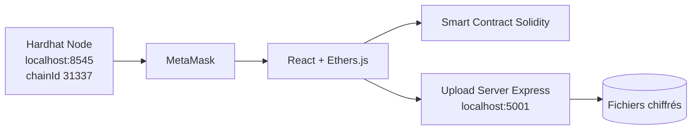

# Système de Gestion des Contrôles — Blockchain (ENSA Tétouan)

> Projet Final — Module Fondamentaux de la Blockchain (M356)  
> ENSA Tétouan — Département IA & Digitalisation

<p align="center">
  
  
  
  
  
</p>

Plateforme décentralisée de gestion des devoirs/contrôles basée sur **Ethereum** :
- rôles **Admin / Enseignant / Étudiant**
- modules + coefficients, devoirs, soumissions, corrections
- soumissions **confidentielles** (RSA pour texte, AES pour fichiers)
- stockage fichiers **off-chain** (Express + multer)
- anti-plagiat simple côté enseignant (similarité)

---

## Fonctionnalités

- **Admin** : inscription enseignants/étudiants + création modules + affectations
- **Enseignant** : clé publique on-chain (profil), création devoirs, correction
- **Étudiant** : voit uniquement ses modules, soumission avant deadline
- **Traçabilité** : identité blockchain via `msg.sender`
- **Sécurité** : clé privée prof jamais stockée on-chain

---

## Architecture (résumé)



## Installation & Exécution (local)

### Prérequis
- Node.js (>= 16)
- MetaMask
- Git

### 1. Cloner
```bash
git clone https://github.com/itsmawna/projet-blockchain-controles
cd projet-blockchain-controles
```
### 2. Installer les dépendances
```bash
npm install
cd frontend && npm install && cd ..
cd upload-server && npm install && cd ..
```
### 3. Compiler le contrat
```bash
npx hardhat compile
```
### 4. Lancer Hardhat (Terminal 1)
```bash
npx hardhat node
```
### 5. Déployer le contrat (Terminal 2)
```bash
npx hardhat run scripts/deploy.js --network localhost
```
Le script génère contract-address.json.
Mets ensuite l’adresse dans frontend/src/App.jsx (CONTRACT_ADDRESS).

### 6. Lancer le serveur upload (Terminal 3)
```bash
cd upload-server
node server.js
```

API : http://localhost:5001

### 7. Lancer le frontend (Terminal 4)
```bash
cd frontend
npm run dev
```

## Configuration MetaMask (Hardhat Local)

Ajouter un réseau dans MetaMask :
- **RPC URL** : `http://127.0.0.1:8545`
- **Chain ID** : `31337`
- **Currency** : `ETH`

Importer un compte Hardhat via la **clé privée** affichée dans le terminal Hardhat.

---

## Tests
```bash
npx hardhat test test/SystemeGestionControles.test.js
```

Résultat attendu :  **tests pass** (smart contract stable).

---

## Dépannage rapide

### Contrat non trouvé
- vérifier `CONTRACT_ADDRESS` (frontend)
- vérifier que le réseau MetaMask actif est **localhost (31337)**
- vérifier que **Hardhat Node** est en cours d’exécution

### Étudiant ne voit aucun devoir
- l’admin doit avoir **affecté l’étudiant à un module**
- le devoir doit appartenir à ce module

### Soumission refusée
- date limite dépassée
- étudiant non inscrit au module
- devoir déjà soumis (protection anti double soumission)

```
<div align="center"> Projet réalisé dans le cadre du module M356 — Fondamentaux de la Blockchain (ENSA Tétouan). </div>
```
