# 📚 Système de Gestion des Contrôles - Blockchain (ENSA Tétouan)

> Projet Final - Module Fondamentaux de la Blockchain (M356)  
> ENSA Tétouan - Département IA & Digitalisation


## 🎯 À Propos

Plateforme décentralisée de gestion des contrôles/devoirs basée sur **Ethereum**, avec :
- gestion des **rôles** (Admin / Enseignant / Étudiant),
- gestion des **modules & coefficients**,
- **soumissions chiffrées** (RSA pour texte + AES pour fichiers),
- **upload off-chain** des fichiers (serveur Express + multer),
- **anti-plagiat simple** côté enseignant (comparaison de similarité).

L’objectif est de garantir **traçabilité**, **intégrité**, **équité** et **confidentialité** des soumissions.

---

## ✨ Fonctionnalités clés

### ✅ Gestion académique
- **Admin** : inscrit enseignants/étudiants + affecte les étudiants aux modules
- **Enseignant** : crée des devoirs dans ses modules + corrige ses soumissions
- **Étudiant** : voit uniquement les devoirs de ses modules + soumet avant la date limite

### 🔐 Chiffrement & Fichiers
- **Texte (réponse + identité)** : chiffré en **RSA (RSA-OAEP 2048)** avec la clé publique du prof
- **Fichier (optionnel)** : chiffré en **AES**, puis uploadé sur serveur off-chain
- La **clé AES** est ensuite chiffrée en RSA avec la clé publique du prof
- Le prof **déchiffre** avec sa **clé privée locale** (jamais stockée on-chain)

### 🧾 Correction
- Correction liée à une **soumission précise** (donc automatiquement liée à l’étudiant qui a soumis)
- Possibilité d’ajouter un **fichier de correction** (upload)

---

## 🏗️ Architecture

```
┌─────────────────────────────────────────────────────┐
│                   FRONTEND (React)                   │
│  ┌──────────────┐  ┌──────────────┐  ┌───────────┐ │
│  │ Enseignants  │  │  Étudiants   │  │   Admin   │ │
│  └──────────────┘  └──────────────┘  └───────────┘ │
└───────────────────────┬─────────────────────────────┘
                        │ Ethers.js
                        ▼
┌─────────────────────────────────────────────────────┐
│              SMART CONTRACT (Solidity)               │
│  ┌─────────────────────────────────────────────┐   │
│  │   SystemeGestionControles.sol               │   │
│  │   • Gestion des devoirs                     │   │
│  │   • Soumissions chiffrées                   │   │
│  │   • Corrections                              │   │
│  │   • Annonces                                 │   │
│  └─────────────────────────────────────────────┘   │
└───────────────────────┬─────────────────────────────┘
                        │
                        ▼
┌─────────────────────────────────────────────────────┐
│              BLOCKCHAIN ETHEREUM                     │
│         (Immuable, Décentralisée, Sécurisée)        │
└─────────────────────────────────────────────────────┘
```


```mermaid
flowchart LR
  HH[Hardhat Node<br/>localhost:8545<br/>chainId 31337] --> MM[MetaMask]
  MM --> R[React + Ethers.js]
  R --> SC[Smart Contract Solidity]
  R --> UP[Upload Server Express<br/>localhost:5001]
  UP --> FS[(Fichiers chiffrés)]
```

## 🚀 Installation Rapide

### Prérequis

- Node.js v16+
- NPM ou Yarn
- MetaMask
- Git

### Étape 1 : Cloner le projet

```bash
git clone <url-du-repo>
cd systeme-gestion-controles-blockchain
```

### Étape 2 : Installer les dépendances

```bash
# Backend
npm install

# Frontend
cd frontend
npm install
cd ..
```

### Étape 3 : Upload server
```bash
cd upload-server
npm init -y
npm i express cors multer
cd ..
```
### Étape 4 : Compiler le contrat

```bash
npx hardhat compile
```

### Étape 5 : Démarrer le réseau local

```bash
# Terminal 1
npx hardhat node
```

### Étape 6 : Déployer le contrat

```bash
# Terminal 2
npx hardhat run scripts/deploy.js --network localhost
```
Le script écrit l’adresse dans contract-address.json.
Ensuite, mets à jour l’adresse dans frontend/src/App.jsx :
```bash
const CONTRACT_ADDRESS = "ADRESSE_DEPLOYEE";
```
### Étape 8 : Lancer backend
```bash
cd upload-server
npm init -y
npm i express cors multer
node server.js
```
Serveur : http://localhost:5001

Upload : POST http://localhost:5001/upload

Download : http://localhost:5001/files/<filename>
### Étape 8 : Lancer l'interface

```bash
cd frontend
npm run dev
```

Accéder à `http://localhost:3000` 

## 📖 Guide d'Utilisation

### Pour l'Administrateur (deployeur)

1. Se connecter avec le wallet déployeur (admin)
2. Inscrire enseignants + étudiants
3. Affecter les étudiants aux modules (un étudiant peut être inscrit dans plusieurs modules)
**Important : l’étudiant ne peut soumettre que s’il est inscrit au module du devoir.**
```bash
# Utiliser le script interactif
npx hardhat run scripts/manage-users.js --network localhost
```

### Pour les Enseignants

1. Se connecter avec MetaMask
2. Aller dans Profil → Générer & enregistrer :
   -clé publique enregistrée on-chain
   -clé privée stockée localement (navigateur)
3. Créer un devoir (uniquement dans ses modules)
4. Corriger :
   -charger ses soumissions
   -coller / charger sa clé privée
   -déchiffrer + noter

Chaque soumission est liée à l’étudiant via msg.sender dans le smart contract.

### Pour les Étudiants
1. Se connecter avec MetaMask
2. Voir uniquement les devoirs des modules où il est inscrit
3. Soumettre :
   -texte chiffré RSA
   -fichier optionnel chiffré AES + upload

4. Consulter ses notes & télécharger la correction si disponible

## 🔒 Sécurité

### RSA (texte)

-L’enseignant publie sa clé publique (profil) sur la blockchain.
-Lors de la création du devoir, le devoir stocke la clé publique de chiffrement.
-L’étudiant chiffre identité + réponse avec la clé publique du devoir.

### AES (fichier)

-L’étudiant génère une clé AES aléatoire
-chiffre le fichier avec AES
-upload le contenu chiffré au serveur
-chiffre la clé AES avec la clé publique RSA du prof
-stocke (hash/nom/type/uri/cleAESChiffree) dans la blockchain

**La clé privée n’est jamais stockée on-chain.**
## Sécurité et chiffrement (RSA + AES) : details

Ce projet utilise un **chiffrement hybride** combinant **RSA** et **AES**, comme dans les systèmes réels (HTTPS, PGP, etc.).

**Objectif :**
- Garantir que **seul l’enseignant** peut lire les soumissions
- Chiffrer efficacement les **textes** et les **fichiers**
- Éviter toute gestion de clés côté étudiant

---

## 1. Algorithmes utilisés

### 🔑 RSA (asymétrique)
- Paire de clés : **clé publique / clé privée**
- Utilisé pour :
  - Chiffrer le texte (`contenuChiffre`, `identiteChiffree`)
  - Chiffrer la **clé AES** (`cleAESChiffree`)
- Clé publique : stockée **on-chain** dans le devoir
- Clé privée : stockée **localement chez l’enseignant**

Dans le code :
- `rsaEncrypt(message, publicKey)`
- `rsaDecrypt(ciphertext, privateKey)`
- RSA-OAEP 2048 + SHA-256 (WebCrypto)

---

### 🗝️ AES (symétrique)
- Une **seule clé secrète**
- Utilisé pour :
  - Chiffrer les **fichiers volumineux** (PDF, DOC, ZIP…)
- Rapide et efficace pour les gros fichiers

Dans le code :
- `generateAESKey()`
- `encryptFileContentToString(file, aesKey)`
- `decryptAesStringToBytes(encrypted, aesKey)`

---

### 🔍 SHA-256 (hash)
- **Ne chiffre pas**
- Sert à vérifier l’intégrité du contenu
- Si le fichier change → le hash change

📌 Utilisé pour :
- `fichierHash`
- Vérification d’intégrité des fichiers uploadés

---

## 2. Principe du chiffrement hybride (simple)

- RSA seul → trop lent pour les fichiers
- AES seul → problème pour transmettre la clé
- **RSA + AES** → solution optimale

**Idée clé :**
> Le fichier est chiffré avec AES,  
> et la clé AES est chiffrée avec RSA.

---

## 3. Flux : Étudiant → Blockchain → Enseignant

```text
[ ÉTUDIANT ]
    |
    |-- RSA(publicKeyProf)
    |      ├─ contenuChiffre        (réponse texte)
    |      ├─ identiteChiffree      (nom / identité)
    |
    |-- AES
    |      ├─ fichier chiffré
    |      ├─ fichierHash (SHA-256)
    |
    |-- RSA(publicKeyProf)
    |      └─ cleAESChiffree
    |
    v
[ BLOCKCHAIN ]
    ├─ contenuChiffre
    ├─ identiteChiffree
    ├─ fichierHash
    ├─ fichierNom
    ├─ fichierType
    ├─ fichierURI          (serveur d’upload)
    ├─ cleAESChiffree
    └─ etudiant = msg.sender (adresse Ethereum)
    |
    v
[ ENSEIGNANT ]
    |
    |-- RSA(privateKeyProf)
    |      ├─ déchiffre contenuChiffre
    |      ├─ déchiffre identiteChiffree
    |      └─ déchiffre cleAESChiffree → clé AES
    |
    |-- AES
    |      └─ déchiffre le fichier depuis fichierURI
```


## 4. Flux : Enseignant → Blockchain → Étudiant
```text
[ ENSEIGNANT ]
    |
    |-- AES
    |      └─ fichier de correction chiffré
    |
    |-- SHA-256
    |      └─ fichierCorrectionHash
    |
    v
[ BLOCKCHAIN ]
    ├─ note
    ├─ commentaire
    ├─ fichierCorrectionHash
    ├─ fichierCorrectionNom
    └─ fichierCorrectionURI
    |
    v
[ ÉTUDIANT ]
    |
    └─ Téléchargement du fichier de correction
       (selon la logique définie par l’enseignant)
```

**Points de sécurité importants**

-Aucune clé privée côté étudiant
-Une seule clé RSA par enseignant
-L’adresse Ethereum (msg.sender) identifie l’étudiant
-Les devoirs utilisent la clé publique du prof
-Si le prof régénère ses clés après un devoir → anciennes soumissions illisibles

## 6. Résumé 

| Élément     | Algorithme | Rôle               |
|------------|------------|--------------------|
| Texte      | RSA        | Confidentialité    |
| Fichiers   | AES        | Performance        |
| Clé AES    | RSA        | Sécurité           |
| Hash       | SHA-256    | Intégrité          |
| Identité   | Ethereum   | Authentification   |

### Protection Anti-Plagiat

Chaque soumission inclut :
- Identité de l'étudiant chiffrée
- Timestamp unique
- Sel cryptographique

→ Même avec les mêmes réponses, les textes chiffrés sont différents

## ✅ Tests (Hardhat) — Résultats d’exécution

Les tests unitaires et d’intégration du smart contract **SystemeGestionControles** ont été exécutés avec succès via Hardhat.

### 🧪 Commande utilisée

```powershell
npx hardhat test test/SystemeGestionControles.test.js
```
### Résultat (tout a bien passé)
```text
SystemeGestionControles (MAX TESTS) - NEW CONTRACT
  Déploiement
    ✔ Admin = deployer
    ✔ Compteurs init à 0
  Inscriptions (Admin)
    ✔ Admin inscrit enseignant (sans clé)
    ✔ Event EnseignantInscrit(moduleId=0)
    ✔ Revert si adresse 0 enseignant
    ✔ Revert si enseignant déjà inscrit
    ✔ Non-admin ne peut pas inscrire enseignant
    ✔ Admin inscrit étudiant (sans clé RSA)
    ✔ Event EtudiantInscrit
    ✔ Revert si adresse 0 étudiant
    ✔ Revert si étudiant déjà inscrit
    ✔ Non-admin ne peut pas inscrire étudiant
    ✔ estEnseignant / estEtudiant
  Clé publique prof (Self-service)
    ✔ Enseignant définit clé (ok + event)
    ✔ Revert clé vide enseignant
    ✔ Non-enseignant ne peut pas définir clé enseignant
  Modules (Admin)
    ✔ Créer module OK + event + module attaché au prof
    ✔ Revert si coefficient invalide
    ✔ Revert si adresse enseignant invalide
    ✔ Revert si enseignant non actif
    ✔ Revert si prof a déjà un module
    ✔ Non-admin ne peut pas créer module
    ✔ obtenirModules retourne la liste
  Affectation étudiants aux modules (Admin)
    ✔ Affecter étudiant -> module OK + event + lecture
    ✔ Revert si module inexistant
    ✔ Revert si adresse etudiant invalide
    ✔ Revert si étudiant non actif
    ✔ Revert si déjà inscrit
    ✔ Non-admin ne peut pas affecter
    ✔ Un étudiant peut être affecté à plusieurs modules
  Devoirs (Enseignant)
    ✔ Créer devoir OK + event + champs
    ✔ Revert si module inexistant
    ✔ Revert si date limite invalide
    ✔ Revert si pas le prof du module
    ✔ Non-enseignant ne peut pas créer devoir
    ✔ obtenirTousLesDevoirs retourne IDs
    ✔ obtenirDevoir d'un id non créé retourne id=0 (sans revert)
  Soumissions (Etudiant)
    ✔ Soumettre OK + event + stockage + aDejaSoumis
    ✔ Revert si devoir inexistant (devoirExiste)
    ✔ Revert si date limite dépassée
    ✔ Revert si non-étudiant soumet
    ✔ Revert si étudiant pas inscrit au module du devoir
    ✔ Revert si double soumission
    ✔ Stockage soumissionsParDevoir
    ✔ Stockage soumissionsParEtudiant
    ✔ Soumission contient fichierCorrection vide au début
  Corrections (Enseignant)
    ✔ Corriger OK (note <=20) + event + fichier correction
    ✔ Note 0 acceptée
    ✔ Revert si note > 20
    ✔ Revert si soumission inexistante
    ✔ Revert si autre enseignant corrige
    ✔ Revert si non-enseignant corrige
  obtenirNotesEtudiant()
    ✔ Retourne (soumissionIds, notes, moduleIds) cohérents
    ✔ Si étudiant n'a aucune soumission => tableaux vides
  Annonces
    ✔ Prof publie annonce OK + event
    ✔ Etudiant publie annonce OK
    ✔ Non-inscrit ne peut pas publier
  Intégration complète (happy path)
    ✔ Flux complet : inscriptions -> module -> affectation -> devoir -> soumission -> correction

58 passing (4s)
```
### Rapport Gas (Hardhat Gas Reporter)
Un rapport d’estimation du gas a également été généré automatiquement, permettant d’avoir une vision claire des coûts d’exécution des principales fonctions du contrat.

Extraits (moyenne)
**soumettreDevoir** : ~495,817 gas (avg)

**creerDevoir** : ~297,684 gas (avg)

**creerModule** : ~195,582 gas (avg)

**corrigerSoumission** : ~166,842 gas (avg)

**Déploiement du contrat** : ~3,989,502 gas (≈ 13.3% du block gas limit)

Tous les tests ont été validés avec succès et le rapport gas est disponible dans la sortie Hardhat.


## 📁 Structure du Projet

```
systeme-gestion-controles-blockchain/
├── contracts/
│   └── SystemeGestionControles.sol    # Smart contract principal
├── scripts/
│   ├── deploy.js                       # Script de déploiement
│   └── manage-users.js                 # Gestion des utilisateurs
├── test/
│   └── SystemeGestionControles.test.js # Tests unitaires
├── frontend/
│   ├── src/
│   │   ├── App.jsx                     # Application React
│   │   └── utils/                      # Utilitaires
│   └── package.json
├── hardhat.config.js                   # Configuration Hardhat
├── upload-server/
│   └── server.js
├── .env.example                        # Exemple de configuration
├── package.json
├── contract-address.json
└── README.md
```

## Hardhat + MetaMask : Configuration (étapes réelles du projet)

Cette section décrit **exactement** ce qui a été fait pour :
- configurer Hardhat (réseau local),
- déployer le contrat,
- connecter MetaMask,
- relier le Frontend React au smart contract via Ethers.js.

---

## 1. Pourquoi Hardhat ?

Hardhat est utilisé dans ce projet pour :

- **Compiler** le smart contract Solidity
- **Lancer une blockchain locale** (Hardhat Node) gratuite avec comptes pré-chargés en ETH fictif
- **Déployer** automatiquement le contrat sur ce réseau local
- **Exécuter des tests** unitaires & d’intégration (Hardhat test)
- **Mesurer le gas** (Hardhat Gas Reporter)

L’avantage principal : développement rapide **sans coût réel** (pas besoin de testnet pour coder et tester).

---

## 2. Démarrage de la blockchain locale (Hardhat Node)

Dans un premier terminal :

```bash
npx hardhat node
```
Hardhat affiche alors :
- des adresses Ethereum (accounts)
- leurs clés privées
- l’ETH fictif pour tester les transactions

3. Déploiement du contrat (script Hardhat)
Dans un deuxième terminal (avec le node Hardhat déjà lancé) :

```bash
npx hardhat run scripts/deploy.js --network localhost
```
Script utilisé (déploiement + sauvegarde adresse)
Le script scripts/deploy.js :

- récupère le compte deployer : hre.ethers.getSigners()
- déploie SystemeGestionControles
- affiche l’adresse du contrat
- enregistre les infos dans contract-address.json

Exemple de sortie attendue :
```text
Contrat déployé à l'adresse: 0x...

Administrateur: 0x...(deployer)

Réseau: localhost

Adresse du contrat sauvegardée dans contract-address.json
```
Fichier généré automatiquement :

```json
{
  "address": "0x.....",
  "network": "localhost",
  "deployer": "0x....",
  "deploymentTime": "2025-12-27T..."
}
```
4. Configuration MetaMask (réseau Hardhat Local)
Comme le contrat est sur une blockchain locale, MetaMask doit être connecté au même réseau.

- Ajouter un réseau dans MetaMask
Dans MetaMask → Settings → Networks → Add network :

<p align="center">
  
</p>


5. Importer un compte Hardhat dans MetaMask
Hardhat Node affiche les comptes + clés privées.

Exemple (dans le terminal Hardhat) :
```bash
Account #0: 0x...

Private Key: 0x...
```
Dans MetaMask :

**Import Account* : 

coller la Private Key du compte choisi
<p align="center">
  
</p>

Ce compte devient un utilisateur du système :

- Account #0 : souvent utilisé comme Admin (deployer)
- autres comptes : enseignants / étudiants


6. Lier l’adresse du contrat au Frontend React
Une fois déployé, l’adresse du contrat doit être utilisée dans React.

Dans App.jsx :

```js
const CONTRACT_ADDRESS = "0x......";
```
Cette adresse doit correspondre à contract-address.json (généré par deploy.js).

7. Connexion MetaMask dans React (Ethers.js)
Lors du clic sur Connecter Wallet, l’application :
- demande l’accès au wallet MetaMask
- récupère provider + signer
- vérifie le réseau (chainId = 31337)
- crée l’instance du contrat

**Toutes les transactions sont signées via MetaMask.**

8. Pourquoi msg.sender est important (identité utilisateur)
Dans Solidity, msg.sender représente l’adresse Ethereum du wallet connecté.

Dans ce projet :

l’adresse admin = deployer

l’enseignant et l’étudiant sont identifiés par leur wallet

une soumission est automatiquement liée à l’étudiant qui l’a envoyée (adresse on-chain)

**Donc pas besoin de login/password** :
MetaMask = authentification + signature.
```mermaid
flowchart TD
  A([Début projet]) --> B[Initialisation environnement]
  B --> B1[Installer Node.js + npm]
  B --> B2[Installer Git]
  B --> B3[Installer MetaMask sur navigateur]
  B --> C[Cloner le repository]
  C --> C1[git clone + cd projet]

  C1 --> D[Installation dépendances]
  D --> D1[npm install (racine)]
  D --> D2[cd frontend && npm install]
  D --> D3[cd upload-server && npm install (express cors multer)]

  D3 --> E[Configuration Hardhat]
  E --> E1[Créer hardhat.config.js]
  E1 --> E2[Définir version solidity 0.8.19]
  E2 --> E3[Définir réseau localhost (chainId 31337)]
  E3 --> F[Développement Smart Contract]
  F --> F1[Définir rôles: Admin / Enseignant / Étudiant]
  F1 --> F2[Modules + coefficients + affectation étudiants]
  F2 --> F3[Devoirs: création + date limite + stockage clé publique prof]
  F3 --> F4[Soumissions: msg.sender = étudiant + anti double soumission]
  F4 --> F5[Corrections: liées à soumissionId]
  F5 --> F6[Annonces: prof/étudiant]

  F6 --> G[Compilation]
  G --> G1[npx hardhat compile]

  G1 --> H[Blockchain locale]
  H --> H1[Terminal 1: npx hardhat node]
  H1 --> H2[Comptes + clés privées affichées + ETH fictif]

  H2 --> I[Déploiement]
  I --> I1[Terminal 2: npx hardhat run scripts/deploy.js --network localhost]
  I1 --> I2[deploy.js récupère deployer + déploie contrat]
  I2 --> I3[Écrit contract-address.json]
  I3 --> I4[Copier adresse vers frontend (CONTRACT_ADDRESS)]

  I4 --> J[Configuration MetaMask (Hardhat Localhost)]
  J --> J1[Ajouter réseau: RPC http://127.0.0.1:8545]
  J1 --> J2[Chain ID: 31337]
  J2 --> J3[Currency: ETH]
  J3 --> J4[Importer comptes Hardhat via private keys]

  J4 --> K[Backend Upload Server]
  K --> K1[cd upload-server]
  K1 --> K2[node server.js]
  K2 --> K3[Endpoints: POST /upload , GET /files/:name]

  K3 --> L[Frontend React + Ethers.js]
  L --> L1[Connexion wallet: eth_requestAccounts]
  L1 --> L2[Vérif réseau chainId=31337]
  L2 --> L3[Créer instance contract: new ethers.Contract]
  L3 --> L4[Détection rôle: admin/enseignant/etudiant]
  L4 --> L5[Filtrage UI: devoirs/modules selon rôle]

  L5 --> M[Implémentation sécurité côté client]
  M --> M1[PROF: génération RSA (WebCrypto)]
  M1 --> M2[Clé publique on-chain]
  M2 --> M3[Clé privée en localStorage]
  M3 --> M4[ÉTUDIANT: RSA encrypt texte + identité]
  M4 --> M5[ÉTUDIANT: AES encrypt fichier + upload]
  M5 --> M6[Chiffrer clé AES en RSA avec clé publique prof]
  M6 --> M7[Stocker uri/hash/nom/type/cleAESChiffree on-chain]

  M7 --> N[Tests Hardhat]
  N --> N1[npx hardhat test]
  N1 --> N2[Tests rôles + modules + devoirs + soumissions + corrections]
  N2 --> N3[Happy path + revert cases]
  N3 --> O[Gas Report (optionnel)]
  O --> O1[hardhat-gas-reporter]
  O1 --> P[Documentation]
  P --> P1[README complet: install + sécurité + dépannage + tests]
  P1 --> Q([Fin: projet prêt + démo])
```

## 📊 Fonctionnalités du Smart Contract

## 🧩 Fonctions Smart Contract (résumé)

| Fonction                         | Description                                   | Rôle            |
|----------------------------------|-----------------------------------------------|-----------------|
| `inscrireEnseignant()`           | Inscrire un enseignant                        | Admin           |
| `inscrireEtudiant()`             | Inscrire un étudiant                          | Admin           |
| `affecterEtudiantAuModule()`     | Inscrire un étudiant dans un module           | Admin           |
| `definirClePubliqueEnseignant()` | Enregistrer la clé publique du professeur     | Enseignant      |
| `definirClePubliqueEtudiant()`   | Enregistrer la clé publique de l’étudiant     | Étudiant        |
| `creerDevoir()`                  | Créer un devoir                               | Enseignant      |
| `soumettreDevoir()`              | Soumettre (vérifie l’inscription au module)   | Étudiant        |
| `corrigerSoumission()`           | Noter et commenter une soumission             | Enseignant      |
| `obtenirDevoir()`                | Lire un devoir                                | Tous            |
| `obtenirSoumission()`            | Lire une soumission                           | Tous (lecture)  |

``` mermaid
sequenceDiagram
  autonumber
  participant A as Admin (MetaMask)
  participant P as Prof (MetaMask)
  participant E as Étudiant (MetaMask)
  participant R as React Frontend
  participant C as Smart Contract
  participant U as Upload Server

  Note over A,R: Démarrage (Hardhat Node + Deploy)
  A->>R: Connect Wallet (Account #0)
  R->>C: administrateur() + estEnseignant/estEtudiant
  R-->>A: Role = Admin

  Note over A,C: Admin configure le système
  A->>R: Inscrire Enseignant (adresse prof, nom)
  R->>C: inscrireEnseignant()
  A->>R: Créer module (nom, coeff, prof)
  R->>C: creerModule()
  A->>R: Inscrire Étudiant (adresse, nom, numéro)
  R->>C: inscrireEtudiant()
  A->>R: Affecter étudiant au module
  R->>C: affecterEtudiantAuModule()

  Note over P,R: Prof se prépare (clés RSA)
  P->>R: Connect Wallet (compte prof)
  R->>C: estEnseignant()
  R-->>P: Role = Enseignant
  P->>R: Profil -> Générer clés RSA
  R-->>P: PrivKey stockée localStorage
  R->>C: definirClePubliqueEnseignant(pubKey)

  Note over P,C: Prof crée un devoir
  P->>R: Créer Devoir (titre, desc, date limite)
  opt fichier devoir
    R->>U: Upload fichier devoir (optionnel)
    U-->>R: uri
  end
  R->>C: creerDevoir(moduleId, titre, desc(+URI), pubKey, dateLimite)

  Note over E,R: Étudiant soumet
  E->>R: Connect Wallet (compte étudiant)
  R->>C: estEtudiant() + estInscritDansModule()
  R-->>E: Devoirs filtrés (seulement ses modules)

  E->>R: Soumettre (identité + réponse)
  R->>R: RSA encrypt(reponse, pubKey prof)
  R->>R: RSA encrypt(identite, pubKey prof)

  opt fichier soumission
    R->>R: Générer AES key
    R->>R: AES encrypt(fichier)
    R->>U: Upload fichier chiffré
    U-->>R: uri
    R->>R: RSA encrypt(AES key, pubKey prof)
  end

  R->>C: soumettreDevoir(devoirId, contenuChiffre, identiteChiffree, hash, nom, type, uri, cleAESChiffree)

  Note over P,R: Prof corrige
  P->>R: Charger soumissions de ses devoirs
  R->>C: obtenirSoumissionsDevoir(devoirId)
  R->>C: obtenirSoumission(soumissionId)

  P->>R: Coller/charger clé privée
  R->>R: RSA decrypt(contenuChiffre)
  R->>R: RSA decrypt(identiteChiffree)
  opt fichier soumis
    R->>R: RSA decrypt(cleAESChiffree) -> AES key
    R->>U: Download fichier chiffré (uri)
    U-->>R: encryptedContent
    R->>R: AES decrypt -> fichier clair
  end

  P->>R: Entrer note + commentaire (+ fichier correction optionnel)
  opt fichier correction
    R->>U: Upload correction
    U-->>R: uri
  end
  R->>C: corrigerSoumission(soumissionId, note, commentaire, hash, nom, uri)

  Note over E,R: Étudiant consulte résultat
  E->>R: Mes Notes
  R->>C: obtenirNotesEtudiant(etudiant)
  R-->>E: note + moyenne pondérée
  opt correction disponible
    R-->>E: bouton Télécharger correction (uri)
  end

```


## 🎓 Objectifs Pédagogiques Atteints

- [x] Automatisation des tâches de gestion
- [x] Signature numérique des transactions
- [x] Vérification facile et rapide
- [x] Transparence totale
- [x] Immuabilité des données
- [x] Sécurité renforcée

## 🔧 Technologies Utilisées

### Backend
- **Solidity 0.8.19** : Langage de smart contracts
- **Hardhat** : Framework de développement
- **Ethers.js** : Interaction avec la blockchain
- **OpenZeppelin** : Bibliothèques de sécurité

### Frontend
- **React 18** : Framework JavaScript
- **Tailwind CSS** : Framework CSS utilitaire
- **Ethers.js v6** : Connexion wallet
- **MetaMask** : Wallet Ethereum


## 🐛 Dépannage (problèmes fréquents)

### MetaMask / réseau local
Ajouter le réseau **Hardhat** :
- **RPC URL** : `http://127.0.0.1:8545`
- **Chain ID** : `31337`

---

### ❌ “Contrat non trouvé”
Vérifier :
- le fichier `contract-address.json`
- la valeur de `CONTRACT_ADDRESS` dans `App.jsx`
- que le réseau MetaMask actif est **localhost (31337)**

---

### 👨‍🎓 Étudiant ne voit aucun devoir
- l’admin doit avoir **affecté l’étudiant à un module**
- le devoir doit appartenir à ce module

---

### ⛔ Soumission refusée
Causes possibles :
- date limite dépassée
- étudiant non inscrit au module du devoir
- devoir déjà soumis (protection anti double soumission)


---

<div align="center">

**Fait avec ❤️ pour l'éducation décentralisée**

[Documentation](./README.md) • [Rapport](./rapport.pdf) • [Présentation](./presentation.pdf)

</div>
<div align="center">
Ce projet est réalisé dans le cadre du module M356 - Fondamentaux de la Blockchain.
</div>
